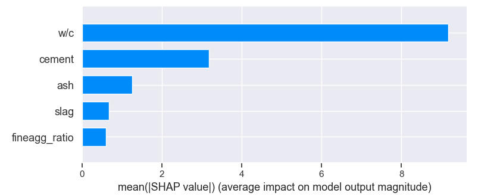

# Cement manufacturing
Analysis of cement manufacturing dataset in order to predict the strength from the components

## Technical background
When we examine the compressive strength of concrete, in the most cases we mean its strength at the age of 28-days. 
The water/cement ratio (usually rather liquid / binder) has a significant effect on the concrete's strength, the lower the w/c ratio, the higher the strength. We can see this correlation be present in the dataset.

It is important to differentiate the distinct types of binders because cement has the highest strength among them. The quantity of the supplementary cementitious materials has a significant effect on the strength.

The goal is to predict the strength from the proportion of the materials.

## Result
After modifying the data to the practical parameters, I built a ML model with Random Forest Regressor, I had an accuracy of 82,3%. 
I made a curve for predicting the strength from the w/c ratio and made a quick calculator.

## Further possible development tips
The place of origin and type of the materials matters much beyond the quantity, too. It would be nice to have data about that as well. 
My suggestion would be to only have 28-days results. The data besides that gives too much opportunity to mislead the analysis and the ML model.