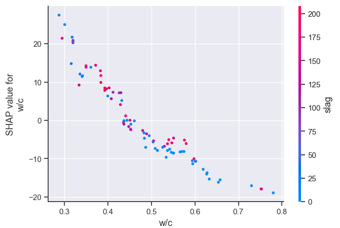

# Cement manufacturing
Analysis of cement manufacturing dataset in order to predict the strength from the components

## Technical background
When we examine the compressive strength of concrete, in the most cases we mean its strength at the age of 28-days. 
The water/cement ratio (usually rather liquid / binder) has a significant effect on the concrete's strength, the lower the w/c ratio, the higher the strength. We can see this correlation be present in the dataset.

It is important to differentiate the distinct types of binders because cement has the highest strength among them. The quantity of the supplementary cementitious materials has a significant effect on the strength.

The goal is to predict the strength from the proportion of the materials.

## Result
I built 3 different ML models for strength prediction. All of them used Random Forest Regressor, but they used different training datasets.  
1. Not using any early strength results, only composition
2. Using composition and 3-days results 
3. Using composition and 3-days and 7- or 14-days results  
    
The results showed up as expected. Long story short, the results are the followings:
  
|                      | Cross-val sore. | Mean squared error | R-Squared score | MAPE  |
|----------------------|-----------------|--------------------|-----------------|-------|
| Only composition     | 0.823           | 42.271             | 0.800           | 0.113 |
| + 3-days results     | 0.844           | 15.105             | 0.931           | 0.079 |
| + 7-/14-days results | 0.879           | 12.942             | 0.941           | 0.072 |
  
It seems, waiting for the 3-days result is a plus that is worth, but waiting for the 7- or 14-days does not gives a big advantage that is worth.  
  

## Further possible development tips
The place of origin and type of the materials matters much beyond the quantity, too. It would be nice to have data about that as well. 
My suggestion would be to only have 3-days, 7-days and most importantly, 28-days results (14-days data can substitute 7-days result, but 7-days is more useful in practice, since it can effect the model earlier).  
The data besides that gives too much opportunity to mislead the analysis and the ML model.

